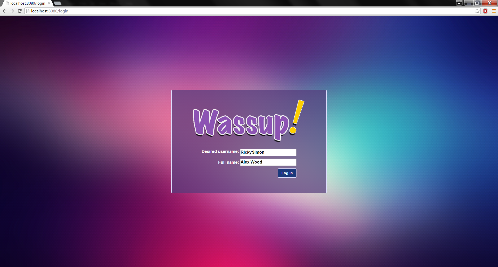
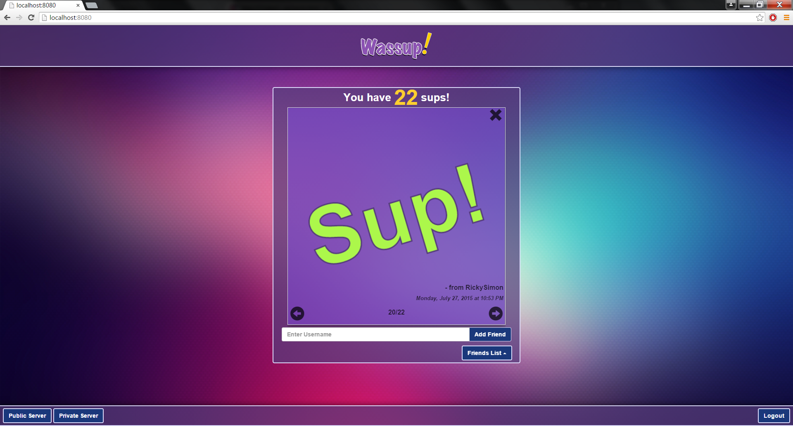

# Wassup!
Wassup is a front-end web application that communicates with a web framework that can store and retrieve data to and from a database. Users can add and remove friends from their contact list aswell as view, send and remove "Sup" messages.
